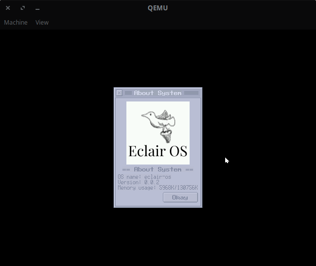

# eclair-os
Éclair OS (Not to be confused with Android Eclair)

This is a new OS project. I won't be abandoning Strange OS. In fact, I am planning to continue working on that for awhile longer. Rather, this will be more of a sister project to Strange. My plan for this project is to have a MUCH more robust architecture overall, and to implement many features that will probably not make the cut for Strange (i.e. 64 bit, multitasking, dynamic loading). My hope is to be able to learn from my many mistakes with Strange OS and try not to make them again. Updates for this project will probably be pretty sporadic for the time being.

## build and run
This project assumes that you are using a Unix-like environment (i.e. Linux, BSD, Mac OS) and you have an x86-64 ELF gcc cross compiler installed. If you're system uses ELF format executables and is an x86-64 machine, you may be able to use your system's gcc installation. However, it is not recommended. Nevertheless, if you have a cross compiler (or would like to use your system compiler anyway), edit the `TARGET` variable in `config.mk` with the associated target triple.

To build the project, just run `make` as you normally would. Run `make run` to run the project in qemu.
